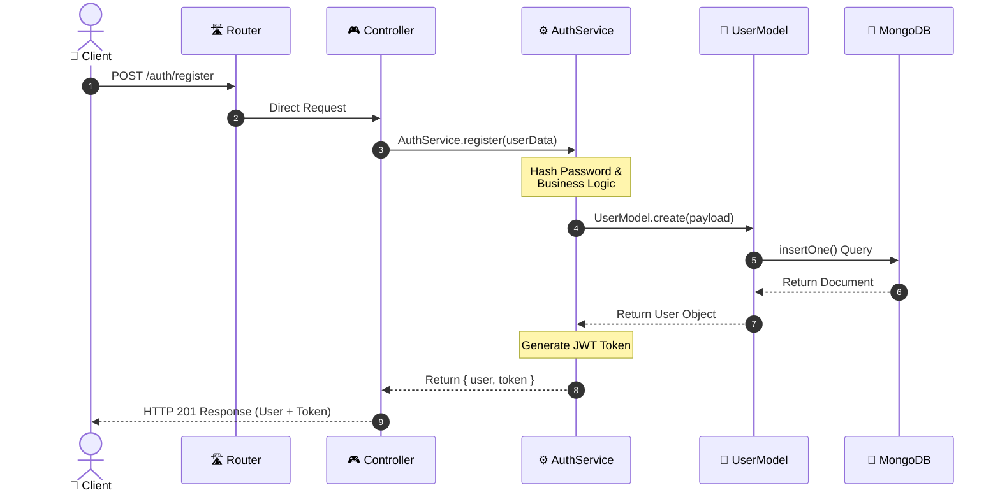

```mermaid
sequenceDiagram
    autonumber
    actor Client as 📱 Client
    participant Route as 🛣️ Router
    participant Ctrl as 🎮 Controller
    participant Service as ⚙️ AuthService
    participant Model as 📄 UserModel
    participant DB as 🍃 MongoDB

    Client->>Route: POST /auth/register
    Route->>Ctrl: Direct Request
    Ctrl->>Service: AuthService.register(userData)
    Note over Service: Hash Password &<br/>Business Logic
    Service->>Model: UserModel.create(payload)
    Model->>DB: insertOne() Query
    DB-->>Model: Return Document
    Model-->>Service: Return User Object
    Note over Service: Generate JWT Token
    Service-->>Ctrl: Return { user, token }
    Ctrl-->>Client: HTTP 201 Response (User + Token)
```
