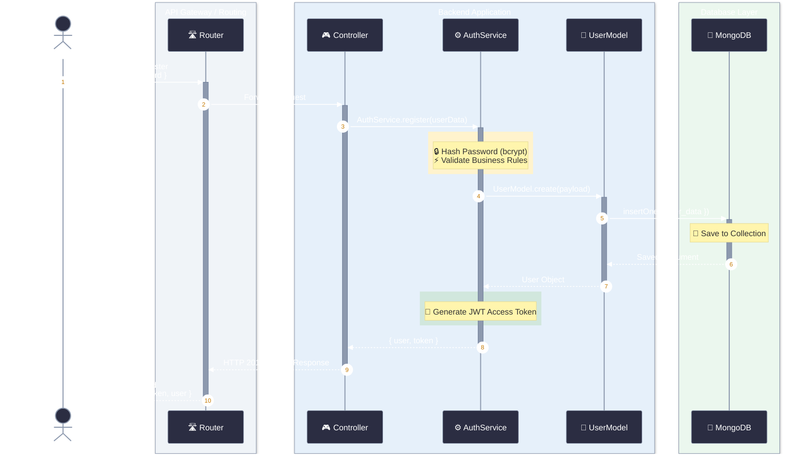

```mermaid
%%{init: {'theme': 'base', 'themeVariables': { 'primaryColor': '#2b2d42', 'primaryTextColor': '#fff', 'primaryBorderColor': '#8d99ae', 'lineColor': '#3a86ff', 'secondaryColor': '#8d99ae', 'tertiaryColor': '#edf2f4'}}}%%

sequenceDiagram
    autonumber
    
    actor Client as 📱 Client
    
    box rgb(240, 244, 248) API Gateway / Routing
        participant Route as 🛣️ Router
    end
    
    box rgb(230, 240, 250) Backend Application
        participant Ctrl as 🎮 Controller
        participant Service as ⚙️ AuthService
        participant Model as 📄 UserModel
    end
    
    box rgb(235, 247, 238) Database Layer
        participant DB as 🍃 MongoDB
    end

    %% --- START FLOW ---
    Client->>+Route: POST /auth/register <br/> { email, password }
    
    Route->>+Ctrl: Forward Request
    
    Ctrl->>+Service: AuthService.register(userData)
    
    rect rgb(255, 243, 205)
        Note over Service: 🔒 Hash Password (bcrypt)<br/>⚡ Validate Business Rules
    end
    
    Service->>+Model: UserModel.create(payload)
    
    Model->>+DB: insertOne({ user_data })
    Note over DB: 💾 Save to Collection
    DB-->>-Model: Saved Document
    
    Model-->>-Service: User Object
    
    rect rgb(209, 231, 221)
        Note over Service: 🔑 Generate JWT Access Token
    end
    
    Service-->>-Ctrl: { user, token }
    
    Ctrl-->>-Route: HTTP 201 Created Response
    
    Route-->>-Client: 201 Created <br/> { status: "success", token, user }
```
